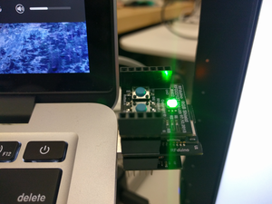
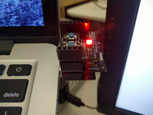

# RFDuino Example App

This project contains a simple RFDuino arduino sketch which turns an LED green when it is connected over BLE and red when it is disconnected.

__Requirements__:

* RFDuino
* RFDuino USB Shield
* RFDuino LED/Buttons Shield

__Connected__:

__Disconnected__:

